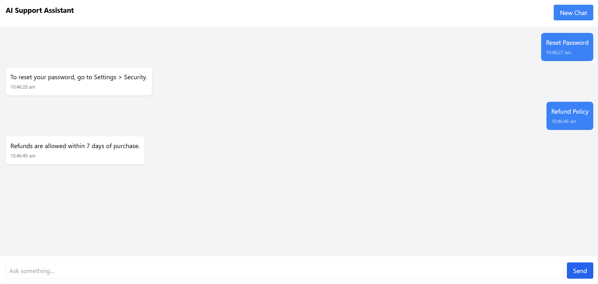
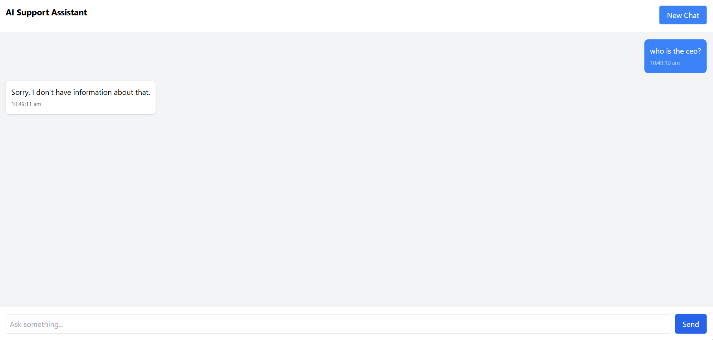

# AI-Powered Support Assistant

A full-stack **AI-powered Support Assistant** that allows users to chat with an AI agent which answers questions strictly based on provided product documentation.

The system maintains **session-based conversation memory**, stores chats in **SQLite**, and ensures responses are generated **only from verified documentation**.

---

## Tech Stack

### Frontend

* React.js (Vite)
* Tailwind CSS
* Axios

### Backend

* Node.js
* Express.js
* SQLite

### AI / LLM

* Groq LLM API (Llama 3.3)

---

## Project Structure

```
ai-support-assistant/
│
├── frontend/
│   ├── src/
│   ├── components/
│   ├── pages/
│   └── api/
│
├── backend/
│   ├── src/
│   │   ├── config/
│   │   ├── controllers/
│   │   ├── routes/
│   │   ├── services/
│   │   └── middleware/
│   └── database.sqlite
│
└── README.md

# Setup Instructions

## 1. Clone Repository

bash
git clone <repo-url>
cd ai-support-assistant

## 2. Backend Setup

```bash
cd backend
npm install
```

Create `.env` file:

```
PORT=5000
OPENAI_API_KEY=YOUR_GROQ_API_KEY
```

Run backend:

```bash
npm run dev
```

Backend runs at:

```
http://localhost:5000


##  3. Frontend Setup

```bash
cd frontend
npm install
npm run dev
```

Frontend runs at:

```
http://localhost:5173
```

---

#  API Documentation

---

##  POST `/api/chat`

Send user message to AI assistant.

### Request

```json
{
  "sessionId": "abc123",
  "message": "How can I reset my password?"
}
```

### Response

```json
{
  "reply": "Users can reset password from Settings > Security.",
  "tokensUsed": 120
}
```

---

## GET `/api/conversations/:sessionId`

Returns conversation history for a session.

### Response

```json
[
  {
    "role": "user",
    "content": "Reset password"
  },
  {
    "role": "assistant",
    "content": "Users can reset password..."
  }
]
```

---

##  GET `/api/sessions`

Returns all available chat sessions.

---

#  Database Schema

SQLite database stores conversations persistently.

---

##  sessions Table

| Column     | Type     | Description      |
| ---------- | -------- | ---------------- |
| id         | TEXT     | sessionId        |
| created_at | DATETIME | session creation |
| updated_at | DATETIME | last activity    |

---

##  messages Table

| Column     | Type     | Description      |
| ---------- | -------- | ---------------- |
| id         | INTEGER  | Primary key      |
| session_id | TEXT     | Linked session   |
| role       | TEXT     | user / assistant |
| content    | TEXT     | message text     |
| created_at | DATETIME | timestamp        |

---

#  Document-Based Answering

The assistant answers **only using**:

```
backend/src/config/docs.json
```

If information is unavailable:

```
Sorry, I don’t have information about that.
```

No hallucinated responses are allowed.

---

#  Context & Memory

* Last **5 user–assistant message pairs** are retrieved from SQLite.
* Context is injected into the LLM prompt.
* Conversation continuity is maintained per session.

---

#  Assumptions

* Documentation represents verified company knowledge.
* Single-user demo environment.
* SQLite used for simplicity and portability.
* LLM responses restricted via prompt guardrails.
* Internet connection required for Groq API.

---

#  Sample UI Screenshots

## Chat Interface


## Conversation View



## New Chat Session



> Place screenshots inside `/screenshots` folder.

---

#  Features

* Session-based chat
* Persistent conversations
* Document-grounded AI responses
* Rate limiting
* Error handling middleware
* Loading state UI
* New chat generation
* Timestamped messages

---

#  Deployment

### Frontend

* Vercel / Netlify

### Backend

* Render / Railway

Environment variables must be configured in deployment dashboard.

---

#  Future Improvements

* Embedding-based semantic search
* Streaming responses
* Authentication
* PostgreSQL migration
* Docker support
* Multi-LLM fallback

---

# Author

AI Support Assistant Assignment Submission

---
